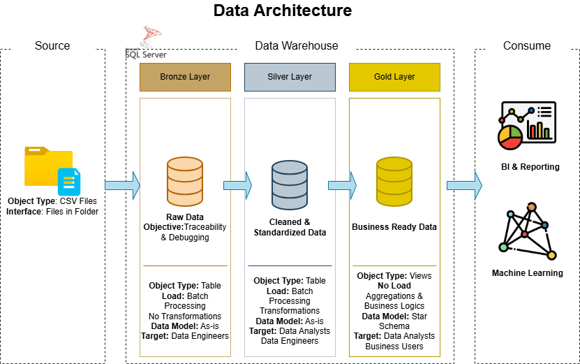
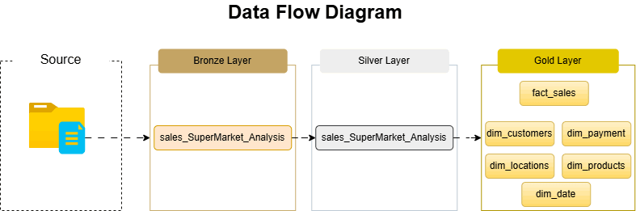
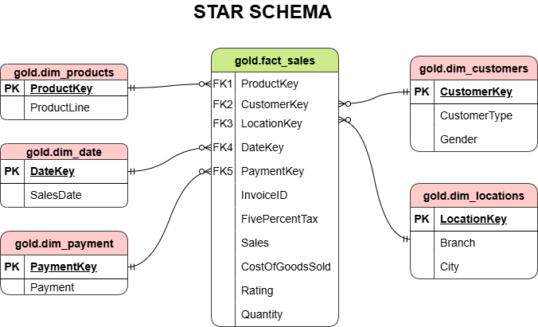
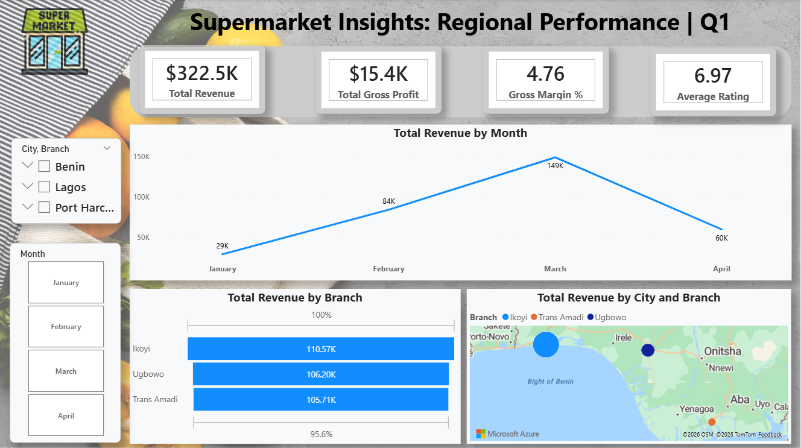
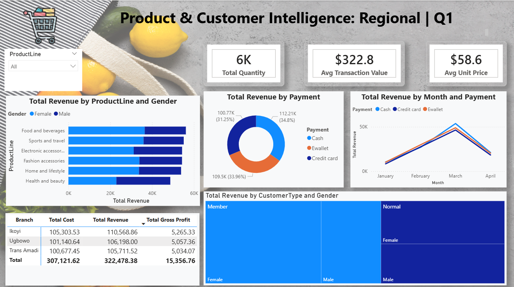
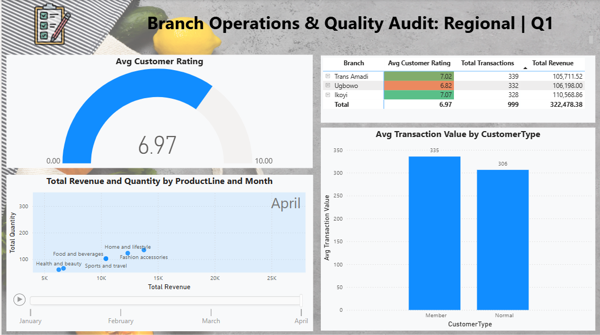

## Project Overview
This project delivers an end-to-end data warehousing and business intelligence solution for a supermarket retail business. Raw transactional data from CSV files is ingested, transformed, and loaded into a structured SQL Server data warehouse following a dimensional modelling approach. The warehouse serves as the single source of truth for BI dashboards and analytical reports that support data-driven decisions across sales, product, customer, and operational domains.

The project is split into two core parts:
Data Engineering — designing and building the warehouse, ETL pipeline, and dimensional model
BI & Analytics — defining KPIs, building reports, and answering key business questions

## Data Source
The source data is a flat CSV file containing supermarket point-of-sale (POS) transaction records with the following columns:
InvoiceID, Branch, City, CustomerType, Gender, ProductLine, UnitPrice, Quantity, Tax(5%),Sales, Date, Payment, Cogs(Cost of goods sold), Rating(1–10)

## Project Requirements
Business Requirements - The business requires a centralised, reliable data platform that enables:

- Consolidated reporting across all branches, cities, product lines, and customer segments from a single source of truth.
- Trend analysis to monitor sales and profitability performance over time (daily, weekly, monthly, quarterly).
- Customer segmentation to understand spend behaviour by customer type and demographic.
- Product performance tracking to identify top-performing and underperforming product lines by revenue, margin, and customer satisfaction.
- Operational insights to understand peak trading periods, payment preferences, and branch-level efficiency.
- Self-service BI so that business stakeholders can access dashboards without requiring direct SQL access.

## Data Engineering: Building the Data Warehouse
### Objectives
The data engineering phase aims to:

- Build a data warehouse using the medallion architecture: Bronze → Silver (Cleansed) → Gold (Integration & Aggregation)
- Design a dimensional model (star schema) optimised for analytical querying in SQL Server
- Enforce data quality rules including deduplication, null handling, type casting, and referential integrity
- Provide a clear documentation of the data model to support both business and analytics teams
  
 

 ## Dataflow

  
 

## BI & Analytics: Reporting and Insights
### Objectives
The BI and analytics phase aims to:

- Connect Power BI to the SQL Server presentation layer and build interactive dashboards
- Surface key business KPIs in a clear, executive-friendly format
- Enable self-service exploration of sales, product, customer, and operational data
- Answer the critical business questions that drive commercial decisions
   

  
The final Power BI suite focuses on three core pillars: Executive Performance, Commercial Intelligence, and Operational Efficiency.

Business Questions & Objectives
The report is architected to solve critical retail challenges by answering the following high-value business questions:

1. Executive Performance (The "What")
Revenue Dynamics: What are the total revenue and gross profit trends across the national network for Q1 2024?
Profitability Guardrails: Which branches are meeting the target Gross Margin %, and where is the cost of goods sold (COGS) eroding profit?
Geographic Growth: How does revenue distribution compare across different cities and branch codes?

2. Commercial Intelligence (The "Who & Why")
Product Mix Optimization: Which product lines generate the highest volume versus those generating the highest revenue?
Customer Segmentation: How do spending patterns differ between Members and Normal customers?
Demographic Preferences: Is there a correlation between gender, customer type, and product line preference?

3. Operational Efficiency & Quality (The "How")
Payment Ecosystem: What is the preferred payment method (Cash, Credit Card, E-wallet), and does it impact the Average Transaction Value (ATV)?
Service Quality Audit: Which branches consistently achieve the highest Customer Satisfaction Ratings, and is there a link between satisfaction and profitability?
Peak Trading Patterns: On which days and months does the supermarket experience peak transaction volume, and how should staffing/inventory respond?

The Power BI Solution
The report is structured into a 3-Page Interactive Experience to cater to different stakeholders:

Executive Summary: A high-level view of KPIs (Revenue, Profit, Margin) using a Waterfall analysis and geographic mapping to identify top-performing regions at a glance.
   
Product & Customer Intelligence: A deep dive into sales volume and demographic behavior, allowing Category Managers to optimize inventory based on actual spending habits.
  
Branch Operations & Quality Audit: A granular matrix-driven view focused on branch-level health, transactional efficiency, and customer satisfaction scores to drive operational improvements.
 
## Technical Specifications
Database - Microsoft SQL Server
ETL Method - T-SQL scripts
Data Modelling - Star Schema — Kimball dimensional modelling methodology
Source Format - CSV (flat file)
Version Control - Git / GitHub
Query Language - T-SQL
BI Tool Micorosft Power BI (connected via Import mode)

### License
This project is licensed under the MIT License. You are free to use, modify and share this project with proper attribution.
